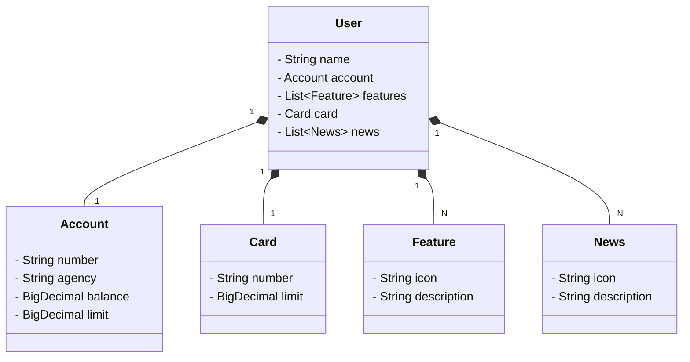

# Publicando API REST na Nuvem Usando Spring Boot 3, Java 17 e Railway

## 🧩 Tecnologias Utilizadas no Projeto
Para o desenvolvimento deste projeto de conclusão de módulo, selecionamos um conjunto moderno e eficiente de tecnologias, com o objetivo de garantir produtividade no desenvolvimento, facilidade de manutenção e escalabilidade da aplicação.

### ☕ Java 17 (LTS)
Utilizamos a versão mais recente com suporte de longo prazo (LTS) do Java, que traz melhorias significativas em performance, segurança e recursos da linguagem. Essa escolha garante uma base sólida e confiável para o projeto.

### 🚀 Spring Boot 3
O Spring Boot foi escolhido por sua abordagem opinativa e foco em produtividade. Com a nova versão 3, temos acesso a atualizações importantes, como suporte ao Java 17 e melhor integração com APIs modernas. Ele também nos permite iniciar projetos com menos configuração e mais foco na regra de negócio.

### 🗄️ Spring Data JPA
Para a camada de persistência de dados, adotamos o Spring Data JPA, que simplifica significativamente a interação com bancos de dados relacionais. Através de uma abordagem baseada em interfaces e convenções, conseguimos realizar operações de CRUD de forma simples e eficiente.

### 📘 OpenAPI (Swagger)
A documentação da API foi feita utilizando OpenAPI (Swagger), o que nos permitiu gerar uma interface visual interativa para explorar os endpoints do sistema. Isso facilita a compreensão da estrutura da API e agiliza o processo de testes e integração com outras aplicações.

### ☁️ Railway
Para o deploy da aplicação na nuvem, utilizamos o Railway, que oferece uma infraestrutura completa com CI/CD, monitoramento e provisionamento de banco de dados como serviço. Essa ferramenta agilizou a publicação da aplicação e permitiu testar o sistema em um ambiente real, acessível pela internet.

# 🎯 Resumo
Com esse conjunto de tecnologias, conseguimos desenvolver uma aplicação moderna, com boas práticas de arquitetura, documentação acessível e pronta para ser implantada em produção. A combinação entre Java, Spring Boot, e Railway proporciona uma base robusta e escalável para evoluções futuras do sistema.

 

 E para finalizar o projeto, usarei o Railway, uma plataforma(PaaS) que torna o Deploy de soluções na nuvem muito mais simples. Assim, podemos nos concentrar no que realmente importa:
      o desenvolvimento das nossas soluções! 

### Diagrama de classes

# Confira...

[🎬 Publicando Sua API REST na Nuvem Usando Spring Boot 3, Java 17 e Railway](https://drive.google.com/file/d/1Wed5rB0u4UWPA--UsNvb4gjJ8DW46Hp-/view?usp=sharing)

