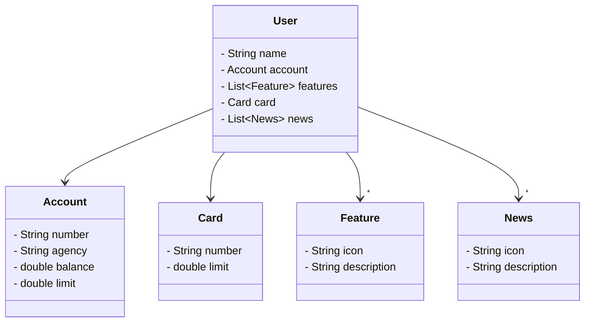

# 🚧 Projeto em construção... 🚧

Construção de uma API REST do zero!
 

Utilizando o Java 17.Para tornar mais produtiva a construção, será empregado o poder do Spring Boot 3, que é amplamente conhecido por potencializar a produtividade
  de desenvolvimento fazendo uso da capacidade de autoconfiguração.

  
Simplificação do acesso aos bancos de dados SQL com o auxílio do Spring Data JPA. Durante nosso percurso, será tratada na prática a importância de uma documentação 
    de API bem construída e fácil de compreender, com o OpenAPI, também conhecido como Swagger.

    
E para finalizar o projeto, usarei o Railway, uma plataforma que torna o Deploy de soluções na nuvem muito mais simples. Assim, podemos nos concentrar no que realmente importa:
      o desenvolvimento das nossas soluções!

### Diagrama de classes

